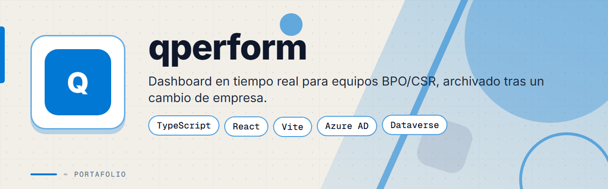
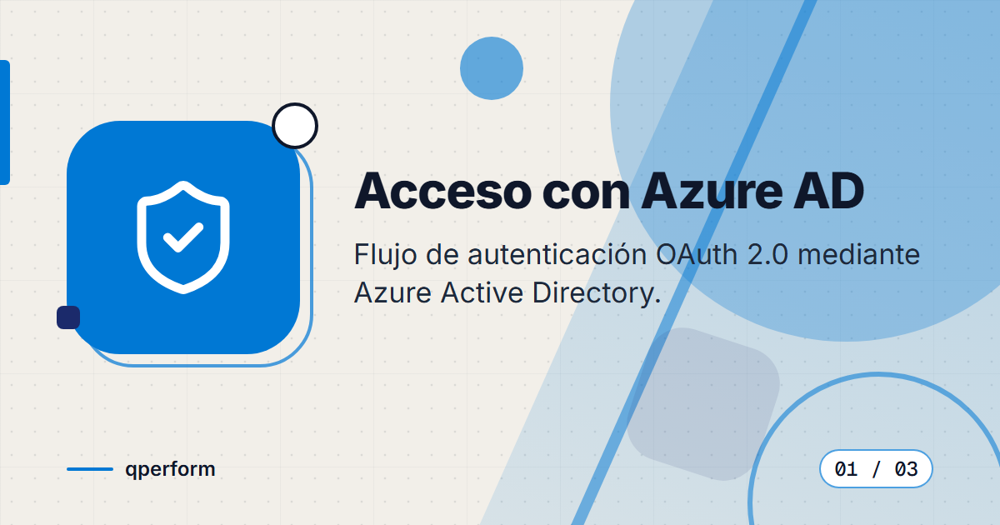
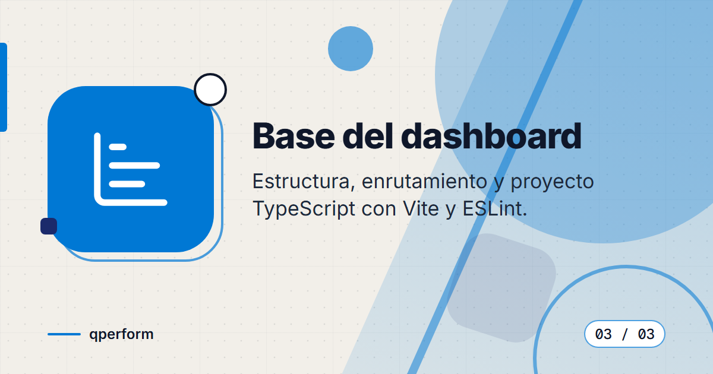
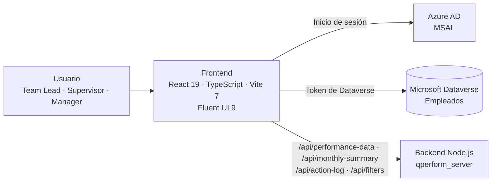

<div align="center">



# QPerform


**Dashboard frontend de desempeño para equipos BPO/CSR: revisión de agentes con bajo rendimiento, resumen mensual y registro de acciones, con acceso por Microsoft Azure AD y datos de Dataverse.**

</div>

> Proyecto archivado: el desarrollo quedó pausado al cambiar de empresa. El código refleja funcionalidades parcialmente completadas y se publica con fines de portafolio.

---

## Contenido

- [El Problema](#el-problema)
- [La Solución](#la-solución)
- [Funcionalidades](#funcionalidades)
- [Vista Previa](#vista-previa)
- [Arquitectura](#arquitectura)
- [Stack Tecnológico](#stack-tecnológico)
- [Instalación local](#instalación-local)
- [Roadmap](#roadmap)
- [Repositorios relacionados](#repositorios-relacionados)
- [Contacto](#contacto)

---

## El Problema

Los líderes de equipo y supervisores de una operación BPO/CSR necesitaban ver con rapidez qué agentes no alcanzaban los objetivos de producción y calidad, y dejar constancia de las acciones tomadas, sin recorrer hojas de cálculo ni reportes sueltos.

---

## La Solución

Una aplicación React con TypeScript que autentica al usuario con Azure AD, lee los datos de desempeño desde un backend propio y los datos de empleados desde Microsoft Dataverse, clasifica a cada agente según estándares definidos y organiza el trabajo en tres vistas: revisión, resumen mensual y bitácora de acciones.

---

## Funcionalidades

| Funcionalidad | Descripción |
|---------------|-------------|
| Acceso con Azure AD | Inicio de sesión con MSAL (OAuth 2.0) y pantalla de acceso denegado para usuarios no autorizados |
| Roles y permisos | Roles AVP, Director, Manager, Assistant Manager, Supervisor, Team Lead y Agent, con permisos derivados del rol |
| Revisión de bajo rendimiento | Vista "Underperforming Review" con filtros compartidos entre pestañas |
| Resumen mensual | Vista "Monthly Summary" con el consolidado de desempeño del periodo |
| Bitácora de acciones | Vista "Action Log" con el historial de acciones registradas |
| Clasificación de desempeño | Niveles Great, Good, Normal, Low y Critical con umbrales separados para Producción y QA, y colores por nivel |
| Acciones y advertencias | Diálogo para registrar acciones (Verbal, Written, Coaching) con verificación de duplicados |
| Recomendaciones | Diálogo de recomendaciones generadas para los agentes |
| Fotos de empleados | Avatares cargados desde Dataverse |
| Bloqueo de orientación | Componente que gestiona la orientación del dispositivo |

---

## Vista Previa

<table>
  <tr>
    <td width="33%">
      
      <br><b>Acceso con Azure AD</b>: autenticación con cuenta Microsoft.
    </td>
    <td width="33%">
      
      <br><b>Datos de Dataverse</b>: consulta de información de empleados.
    </td>
    <td width="33%">
      
      <br><b>Base del dashboard</b>: estructura de vistas y navegación.
    </td>
  </tr>
</table>

---

## Arquitectura



La aplicación tiene cuatro estados (bienvenida, autenticando, autorizado y denegado) y, una vez autorizado, muestra una pantalla con tres pestañas. En desarrollo, Vite redirige las rutas `/api` a `http://localhost:3001`.

---

## Stack Tecnológico

| Capa | Tecnología |
|------|-----------|
| Frontend | React 19 · TypeScript 5.9 · Vite 7 |
| Interfaz | Fluent UI React 9 · Fluent UI Icons |
| Autenticación | Azure AD con @azure/msal-browser y @azure/msal-react |
| Datos | Microsoft Dataverse y API REST del backend |
| Calidad | ESLint 9 con typescript-eslint |
| Despliegue | Scripts PowerShell para Azure (`deploy-backend-azure.ps1`, `setup-azure-ad.ps1`, `setup-dataverse-app.ps1`) |

---

## Instalación local

1. Instala Node.js y clona el repositorio:
   ```bash
   git clone https://github.com/deadlyrat/qperform_dev.git
   cd qperform_dev
   ```
2. Instala las dependencias:
   ```bash
   npm install
   ```
3. Configura las variables de entorno con tus propios valores (por ejemplo en un archivo `.env.local`): `VITE_API_URL`, `VITE_AZURE_CLIENT_ID`, `VITE_AZURE_TENANT_ID` y, opcionalmente, `VITE_DATAVERSE_URL`. Se necesita un registro de aplicación en Azure AD y acceso a un entorno de Dataverse.
4. Levanta el backend de [`qperform_server`](https://github.com/deadlyrat/qperform_server) en el puerto 3001.
5. Inicia el entorno de desarrollo (abre `http://127.0.0.1:5173`):
   ```bash
   npm run dev
   ```
6. Para generar la versión de producción:
   ```bash
   npm run build
   ```

---

## Roadmap

El proyecto está archivado. Quedaron pendientes:

- [ ] Completar las funcionalidades parciales de las vistas.
- [ ] Documentar un archivo de variables de entorno de ejemplo.
- [ ] Añadir pruebas automatizadas.

---

## Repositorios relacionados

| Repo | Propósito |
|------|-----------|
| [`qperform_dev`](https://github.com/deadlyrat/qperform_dev) | App frontend (este repo) |
| [`qperform_server`](https://github.com/deadlyrat/qperform_server) | Servidor backend Node.js |
| [`qperform_server_dev`](https://github.com/deadlyrat/qperform_server_dev) | Rama de desarrollo del backend |
| [`qperform_dev_arch`](https://github.com/deadlyrat/qperform_dev_arch) | Prototipos de arquitectura |

---

## Contacto

Para consultas o propuestas, escríbeme:

[](mailto:pablozam1931@gmail.com)
[%206517--1870-25D366?style=for-the-badge&logo=whatsapp&logoColor=white)](https://wa.me/50765171870)
[](https://github.com/deadlyrat)

- Correo: [pablozam1931@gmail.com](mailto:pablozam1931@gmail.com)
- WhatsApp: [(507) 6517-1870](https://wa.me/50765171870)
- GitHub: [github.com/deadlyrat](https://github.com/deadlyrat)

---

*Parte del portafolio de [deadlyrat](https://github.com/deadlyrat)*
